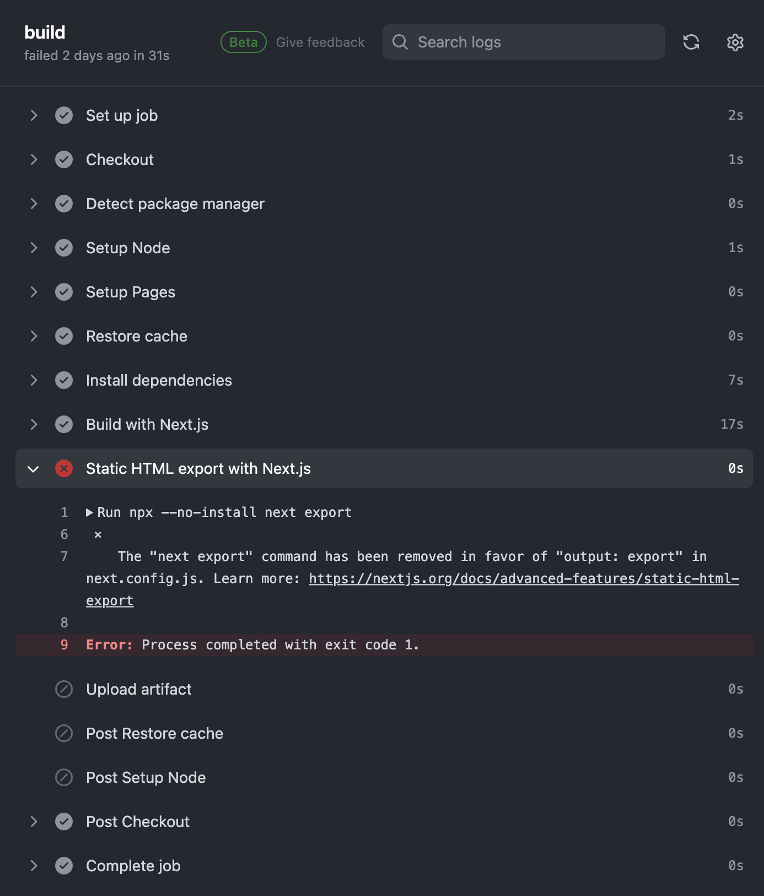

This is the default Next.js page deployed in GitHub Pages. 

## Deploy on Github Pages

You might encounter a common error while attempting to deploy this Next.js boilerplate to GitHub Pages. The default .yml file provided by GitHub Pages Action was triggering an error: “The "next export" command has been removed in favor of "output: export" in next.config.js.”

Gregrickaby's repository is a perfect example for the deployment. Follow its guidelines.
(https://github.com/gregrickaby/nextjs-github-pages)

